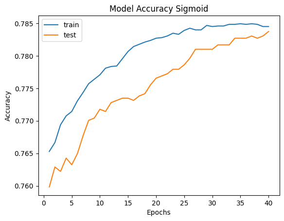
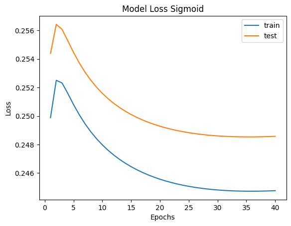
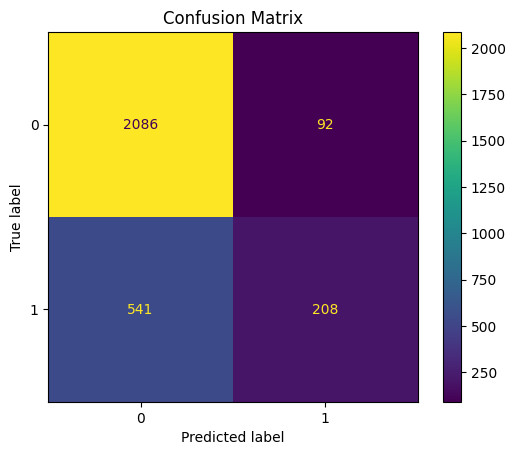
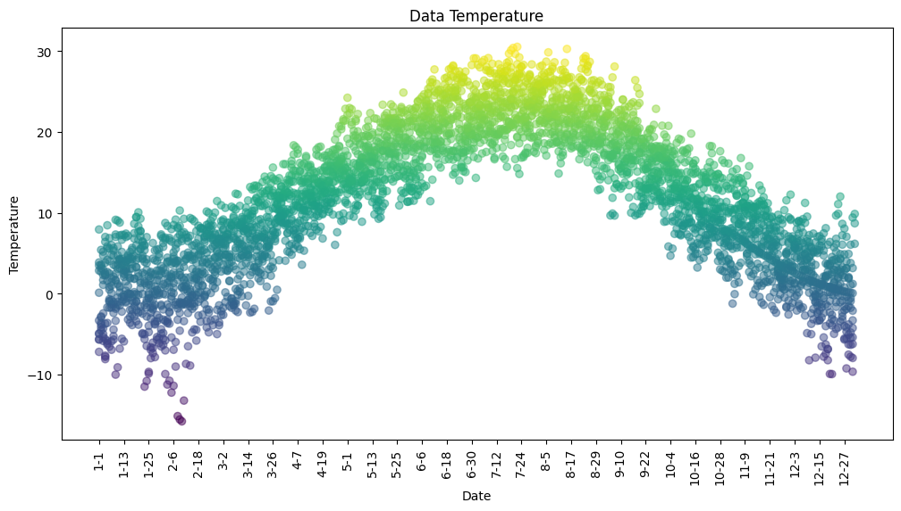
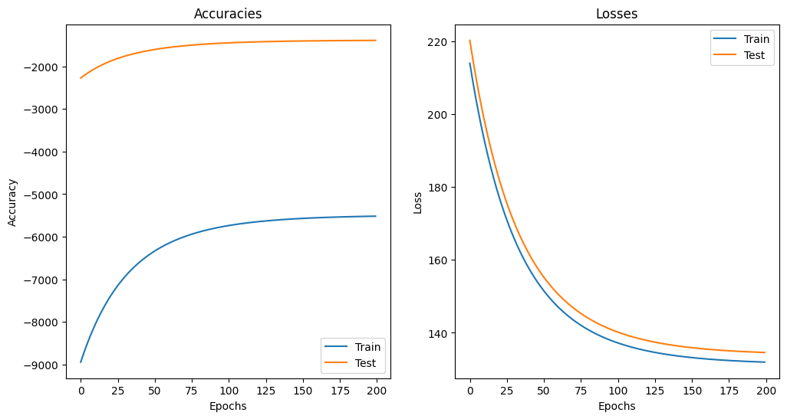
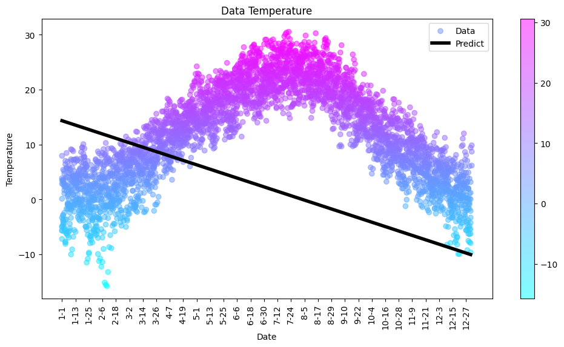

# 6.7.Assignment -> Perceptron (Perception Neuron)

### Install Dependencies:

```bash
pip install -r requirements.txt
```

## Surgical 🏨
### Model Accuracy With Sigmoid

### Model Loss With Sigmoid

### Model Confusion Matrix With Sigmoid

### I have other results with different activation functions in [Surgical](./Surgical.ipynb)

## Forecast 🌦
### Results Table

### Model Accuracies and Losses

### Fitted Line


## I Saved Bias In [Bias](./weight_bias.npy) And Weight In [Weight](./weight_weights.npy)
