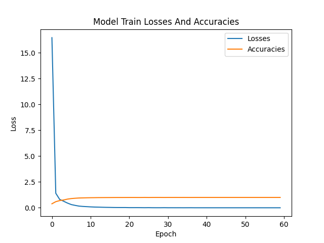
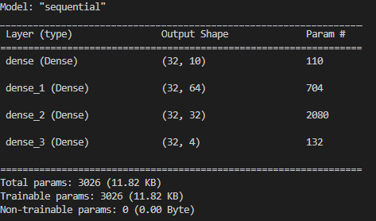

# 6.10.Assignment -> Mini project snake AI with multi layer perceptron


## Train Information with 60 epochs
- Loss: 3.782646672334522e-06
- Accuracy: 1.0

## Test Information
- loss: 6.24897204712482e-06
- Accuracy: 1.0
---


## Network Information



### Install Dependencies:

```bash
pip install -r requirements.txt
```

### Generate A Dataset
```bash
python generate_dataset.py
```

### Train A Network On The Dataset
```bash
python train.py
```

### To Find Out About The Network
```bash
python model_test.py
```

### Get Inference
```bash
python inference_ai.py
```
