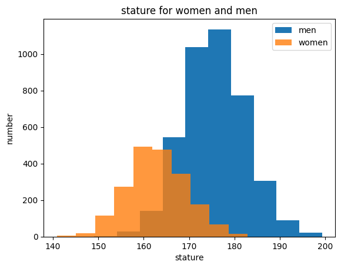
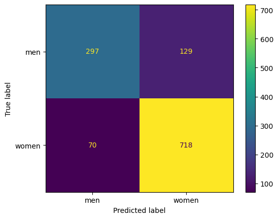

# 6.2.Assignment
## k-Nearest Neighbors (KNN)

### Install Dependencies:
```bash
pip install -r requirements.txt
```
---
---
---
### stature for women and men

---
### confusion metrix for algorithm

---
### my algorithm score is 0.8360790774299836