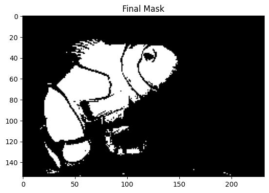
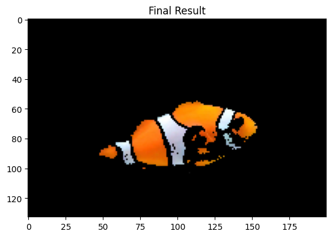
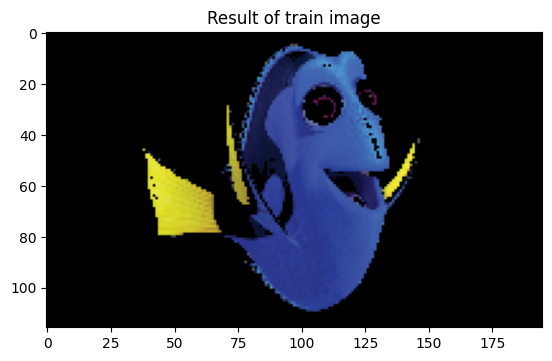
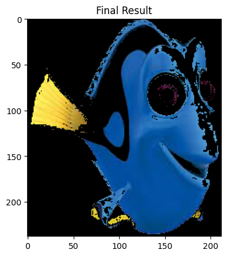
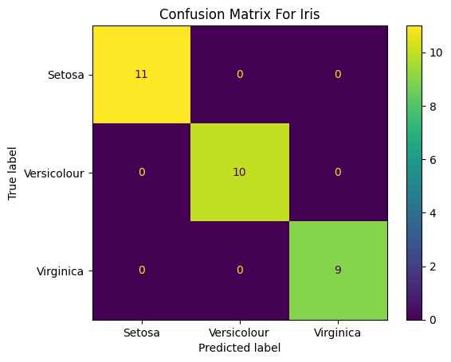
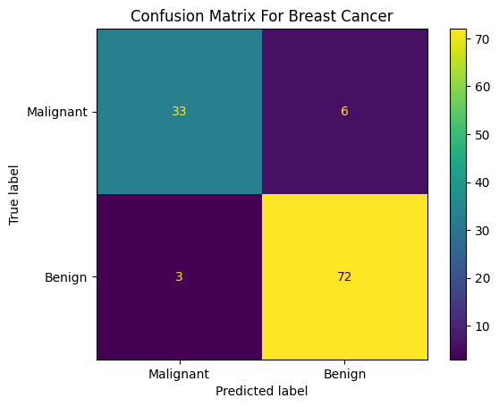

# 6.2.Assignment -> k-Nearest Neighbors (KNN)

### Install Dependencies:
```bash
pip install -r requirements.txt
```

# Finding Nemo
We have 2 classes:
- Nemo
- non-nemo

I used this photo to train the model:
---



I used this photo to test the model:
---



---
---

# Finding Dory
We have 2 classes:
- Dory
- non-Dory

I used this photo to train the model:
---



I used this photo to test the model:
---



---
---

# IRIS dataset

We have 3 classes:
- Setosa
- Versicolour
- Virginica

Features are:
- Sepal Length (cm)
- Sepal Width (cm)
- Petal Length (cm)
- Petal Width (cm)

## Scores of different n_neighbors

|     n_neighbors          |   3    |           5          |            9          |           15           |           21          |
| ------------- | -------- | ---------------------- | ----------------------- | ----------------------- | ----------------------- |
| Accuracy      |     0.966667  |    1.000000  |     0.966667  |     0.966667  |     1.000000  |

## Confusion matrix of test dataset:

---
---

# Breast Cancer dataset

We have 2 classes:
- Malignant
- Benign

Features are:
- real
- positive

## Scores of different n_neighbors

|     n_neighbors          |   3    |           5          |            9          |           15           |                     |
| ------------- | -------- | ---------------------- | ----------------------- | ----------------------- | ----------------------- |
| Accuracy      |     0.912281  |    0.921053  |     0.921053  |     0.921053

## Confusion matrix of test dataset:
