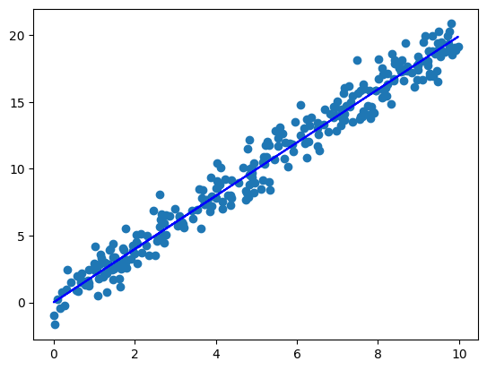

# 6.4.Assignment -> Linear Least Squares (LLS)

### Install Dependencies:
```bash
pip install -r requirements.txt
```

## Students Performance (Regression)
### For each student we have 20 marks and we have 10 hours to study




## Boston house-prices (Regression) 🏠
### *This dataset is available in the old versions of this library and is not available in the new version*

***'rm' with 0.6953 and 'zn' with 0.3604 has highest correlation with price.***


