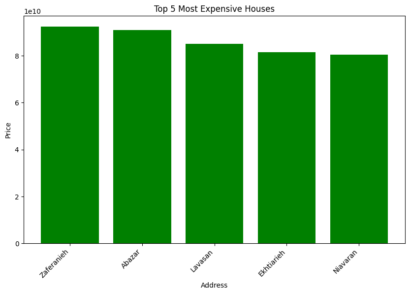

# 6.5.Assignment -> Linear Least Squares (LLS)

### Install Dependencies:

```bash
pip install -r requirements.txt
```

## Train Test Split Function:fork_and_knife::
### I simulated a function written in the Scikit Learn library.

## Tehran House Price 🏠

### I used 50 Tomans to update the dollar price in this dataset



### I chose the data of the number of rooms and the area of the house and whether it has parking or not to fit the algorithm.

## The result of the comparison with Scikit-Learn's results:medal_sports::

<hr/>
*my mae loss is 3033215106.270, my mse loss is 4.151e+19, my rmse loss is 6443097772.87*
<hr/>
*RidegeCV mae loss is 2767883624.627, RidegeCV mse loss is 3.740e+19, RidegeCV rmse loss is 6116073415.695*
<hr/>
*LinearRegression mae loss is 2768052546.693, LinearRegression mse loss is 3.740e+19, LinearRegression rmse loss is 6115849874.478135*

## Dollar Rial Price 💰

### Highest dollar price in Ahmadinejad, Rouhani and Raisi's presidency respectively:heavy_dollar_sign::
- highest dollar price of ahmadinejad presidency is ***39700*** Rial.
- highest dollar price of rohani presidency is ***320060*** Rial.
- highest dollar price of raisi presidency is ***555600*** Rial.

### Lowest dollar price in Ahmadinejad, Rouhani and Raisi's presidency respectively:heavy_dollar_sign::
- lowest dollar price of ahmadinejad presidency is ***13350*** Rial.
- lowest dollar price of rohani presidency is ***12850*** Rial.
- lowest dollar price of raisi presidency is ***251250*** Rial.

### MAE loss:
- MAE of ahmadinejad is ***8.012e+24***.
- MAE of rohani is ***4.336e+25***.
- MAE of raisi is ***5.167e+25***.
