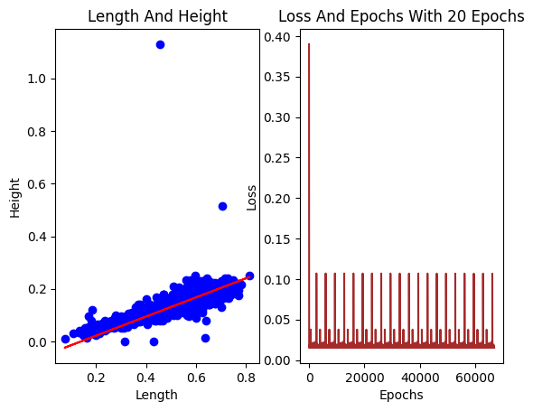

# 6.6.Assignment -> Perceptron (Perception Neuron)

### Install Dependencies:

```bash
pip install -r requirements.txt
```

## Employee's salary 💵

### I made a linear dataset using scikit-learn library:
- with 100 samples of employees
- I made a years of experience range form 0 to 20
- I made a salary range form 20000 to 150000


### First try with 3 epochs:


### Best try with 20 epochs:


## Abalone 🐚

### First try with 5 epochs:


### Best try with 20 epochs:


## Boston house-prices 🏠

### with 25 epochs:


