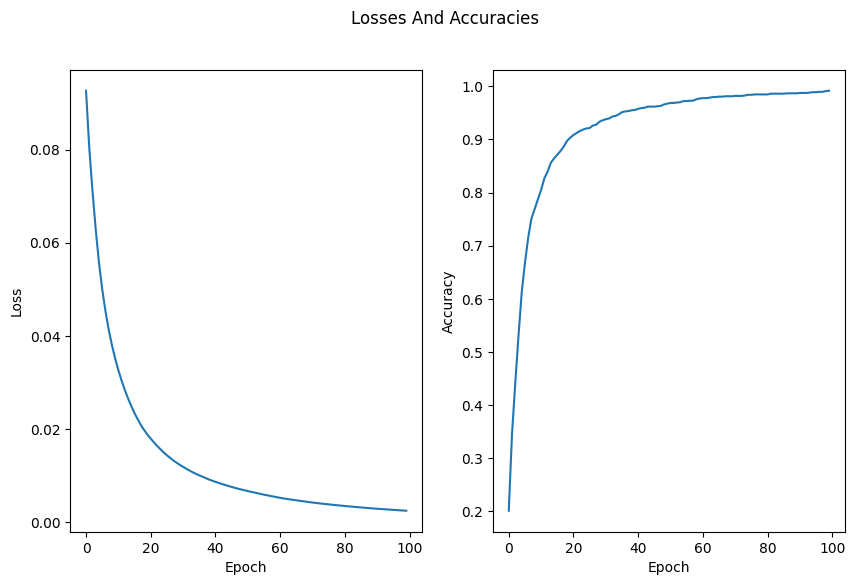

# 6.8.Assignment -> MLP (Multilayer Perceptron)

### Install Dependencies:

```bash
pip install -r requirements.txt
```

## I implemented my neural network as a class:
### Losses and Accuracies of my MLP in 100 epochs


## Information About It:
- **accuracy_train: *0.9916492693110647***
- **accuracy_test: *0.8888888888888888***
- **loss_train: *0.0024207044180093113***
- **loss_test: *0.015910050921797165***
