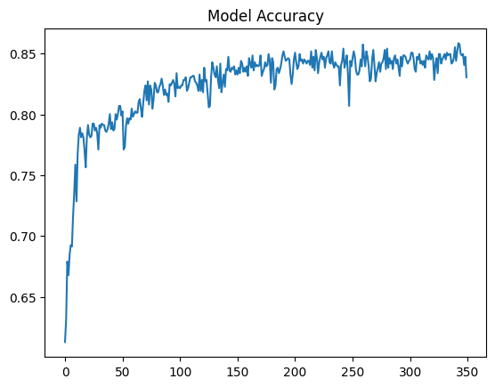
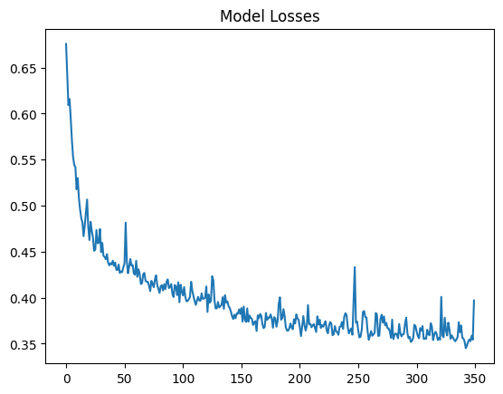

# 6.9.Assignment -> MLP using TensorFlow (Multilayer Perceptron)

## In this challenge, we ask you to build a predictive model that answers the question: 🛳
```what sorts of people were more likely to survive?```

### Install Dependencies:

```bash
pip install -r requirements.txt
```
## I chased these features to train the model:
- Pclass
- Sex
- Age
- SibSp
- Parch
- Fare

## I wrote a 3 layers model for training with 350 epochs



## My neural network results are:
- **test accuracy: *0.93540***
- **test loss: *0.49829***

|     Algorithm          |   KNN    |           Perceptron          |            MLP          |
| ------------- | -------- | ---------------------- | ----------------------- |
| Accuracy      |     0.66985  |    0.69457  |     0.9354066848754883  |
