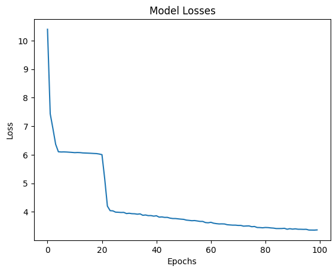
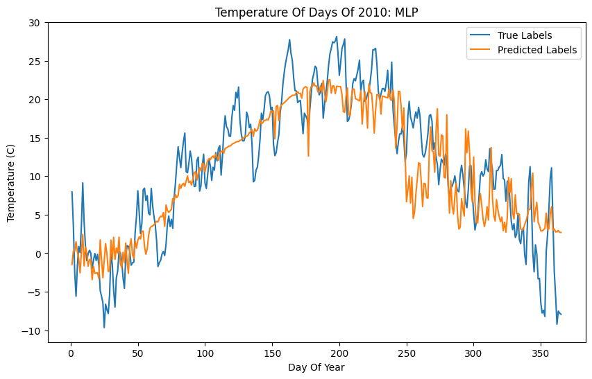
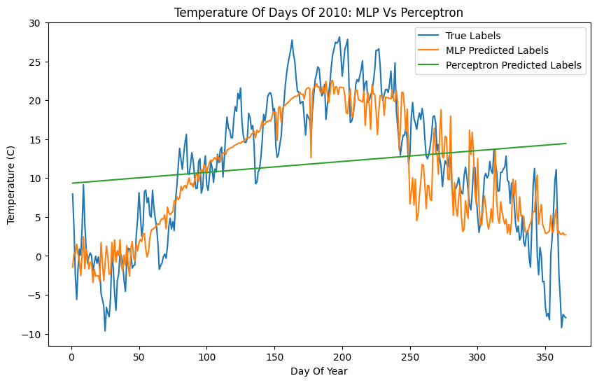
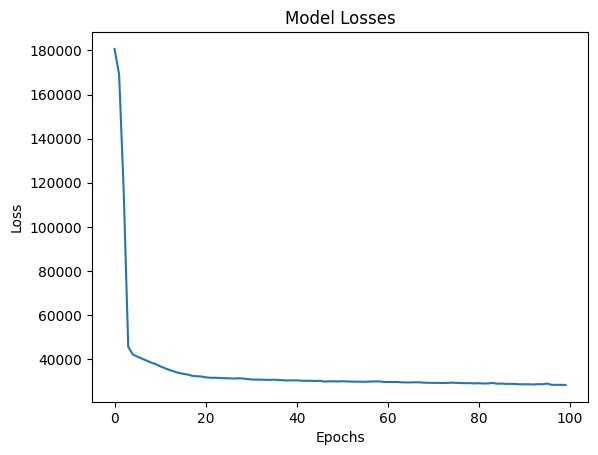
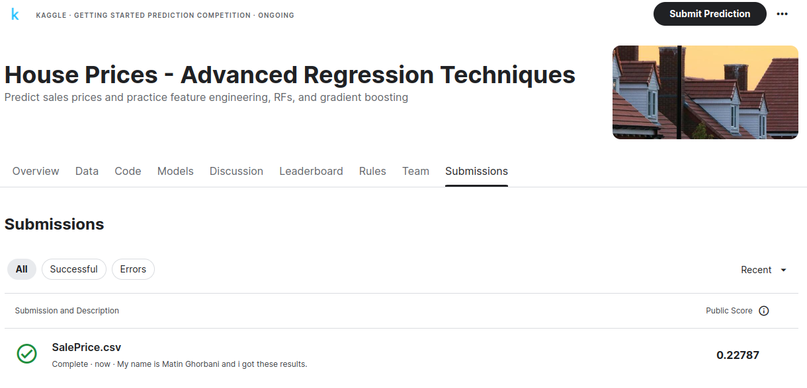

# 6.10.Assignment -> MLP using TensorFlow (Multilayer Perceptron)

## Weather Using Neural Network

### Model Losses With 100 Epochs With *3.2734* loss.

### Fitted Line

### Compare Results Of NN And Perceptron

## House Prices

### Model Losses With 100 Epochs With *25647.9785* loss.

### I Submited My Model Into Kaggle Competition:

