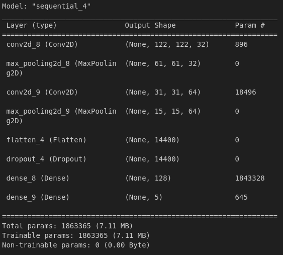
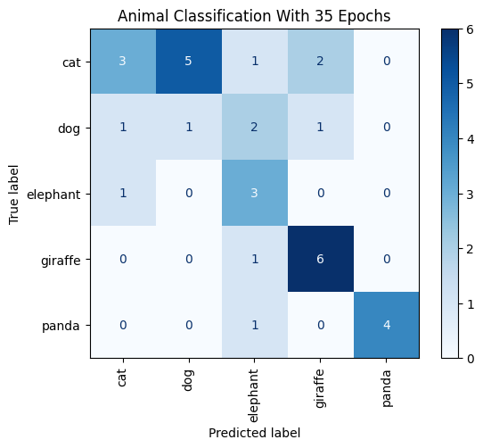
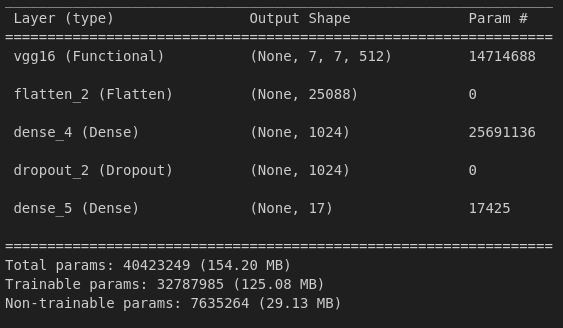
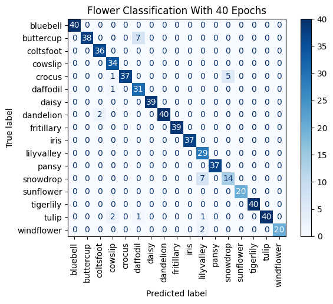

# 7.3.Assignment -> Custom Dataset CNN

## Installing Dependencies
```bash
pip install -r requirements.txt
```
## 5 Animals

### Model Information


### Training And Validation Information
- train loss: ***0.1346***
- train accuracy: ***0.9547***
- validation loss: ***1.5236***
- validation accuracy: ***0.6797S***

### Model Confusion Matrix


## 17 Flowers

### Model Information


### Training And Validation Information
- train loss: ***0.0487***
- train accuracy: ***0.9853***
- validation loss: ***0.5303***
- validation accuracy: ***0.9029***

### Model Confusion Matrix


## Training Information

|           |      Train     |       Validation     |
|---------: | :----------------: |:----------------: |
|    Accuracy:            |       0.9853           |        0.9029           |
|    Loss:        |        0.0487           |          0.5303         |
