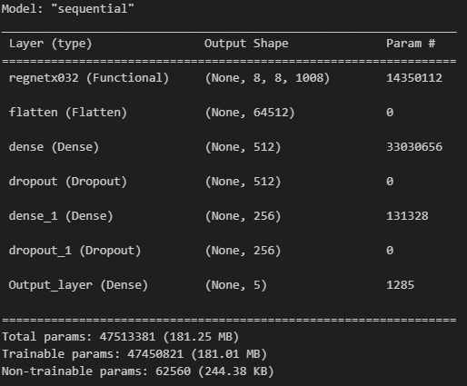
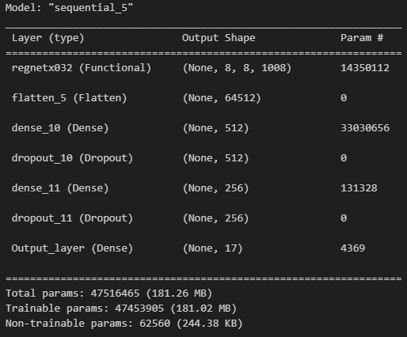
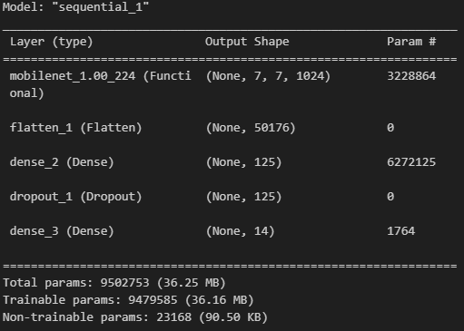
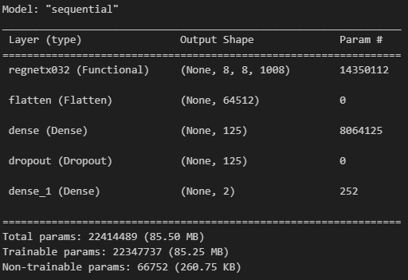

# 7.4.Assignment -> Transfer Learning

## Installing Dependencies
```bash
pip install -r requirements.txt
```
## 5 Animals

### Model Information


### Training And Validation Information
- train loss: ***0.1489***
- train accuracy: ***0.9556***
- validation loss: ***0.3367***
- validation accuracy: ***0.8906***

## 17 Flowers

### Model Information


### Training And Validation Information
- train loss: ***0.2776***
- train accuracy: ***0.9405***
- validation loss: ***0.2415***
- validation accuracy: ***0.9263***

## 7-7 Faces

### Model Information


### Training And Validation Information
- train loss: ***0.1905***
- train accuracy: ***0.9583***
- validation loss: ***0.4904***
- validation accuracy: ***0.8709***

### Model Confusion Matrix


## Akhund And Human Detection

### Model Information


### Training And Validation Information
- train loss: ***0.0239***
- train accuracy: ***0.9947***
- validation loss: ***0.1909***
- validation accuracy: ***0.9021***
