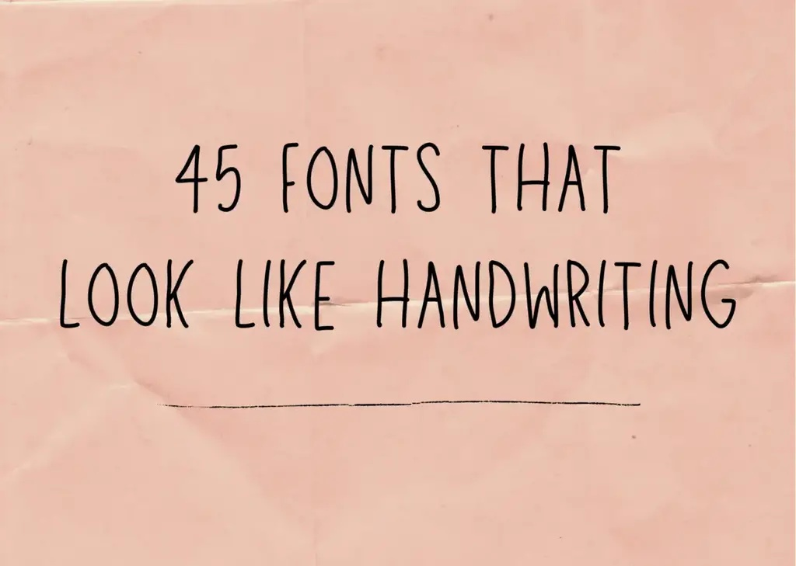
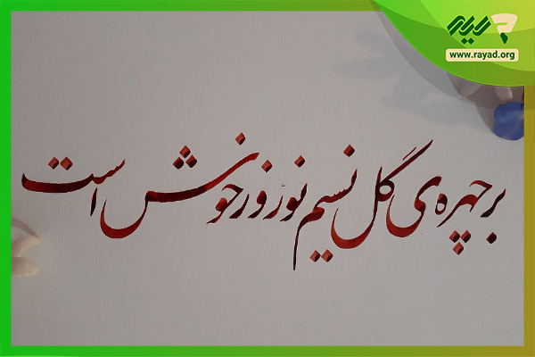
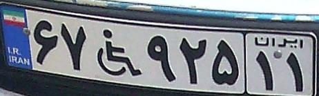
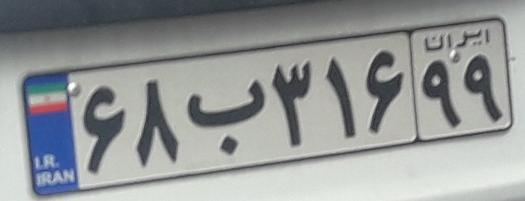
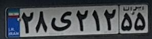
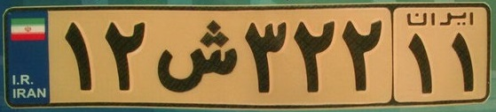
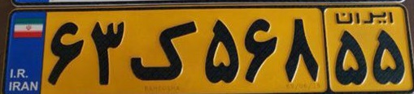

# 7.7.Assignment -> OCR

## Installing Dependencies
```bash
pip install -r requirements.txt
```

## easyOCR
### I Run Inference on a latin hand-writing text image
#### Image:

---
#### Results: 
*`45 FoNTS That`, `LOok LIKE HaNdhriting`*

### I Run Inference on a persian hand-writing text image
#### Image:

---
#### Results: 
*`بچپروی ا نْسیونوْرْوْروشت`*

### I Run Inference on a latin license plate image
#### Image:

---
#### Results: 
*`U $ GovernmenT`, `A193958`*

### I Run Inference on a persian license plate image
#### Image:

---
#### Results: 
*`٣٤٥ب١٢`*

## DTRB Inferences

### I Run Inference on a latin hand-writing text image
#### Image:

---
#### Results: 
*`consuptications`*

### I Run Inference on a persian hand-writing text image
#### Image:

---
#### Results: 
*`sconson`*

### I Run Inference on a latin license plate image
#### Image:

---
#### Results: 
*`a193958`*

### I Run Inference on a persian license plate image
#### Image:

---
#### Results: 
*`trans`*

## DTRB Iranian License Plate Recognition
#### I Have a function in `prepare_dataset.py` to convert xml format to DTRB format

### Dataset  
The data of this [repository](https://github.com/mut-deep/IR-LPR) is used for training.


### Training Information
|Iteration| Train loss | Valid loss | Best accuracy |
|---------| -------- | --------     | -------- |
|9000|   0.00050   |0.69526        | 80.559 |

### Inferences on testing images:
<table>
  <tr>
    <td></td>
    <td></td>
    <td></td>
    <td></td>
    <td></td>
  </tr>
  <tr>
    <td>67922111</td>
    <td>68b31699</td>
    <td>28i21255</td>
    <td>12u32211</td>
    <td>63i56855</td>
  </tr>
   <tr>
    <td>@ : ویلچر</td>
    <td>B : ب</td>
    <td>I : ی</td>
    <td>U : ص</td>
    <td>I : ی</td>
  </tr>
</table>

### This is my [weight](https://drive.google.com/file/d/1-N2uqe1bS0H6TTfLVpLCzlQtTgq7yan3/view?usp=sharing) if you want to test it.
