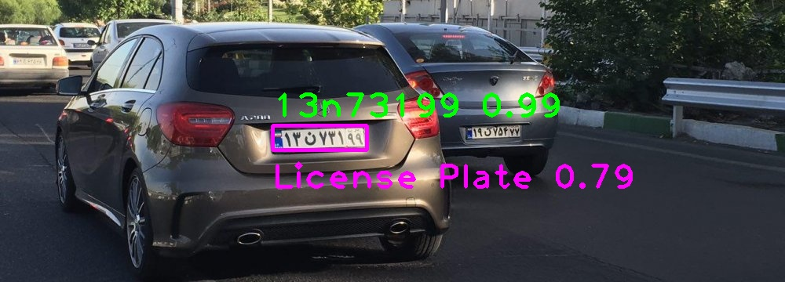
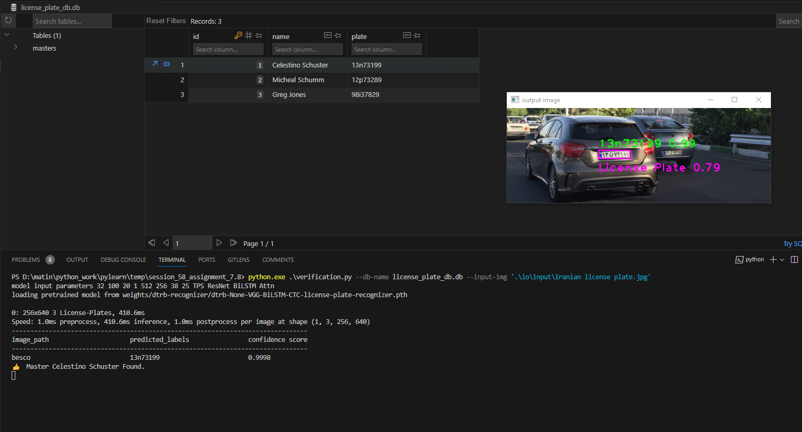

# License Plate Pipeline (Detection, Recognition, Verification)
## These tasks solved with this repo
- Detection: I trained Yolov8 on Iranian License Plates on this [dataset](https://app.roboflow.com/sajjad-aemmi/persian-license-plate-detection)
- Recognizer: I used and trained [Deep Text Recognition Benchmark](https://github.com/clovaai/deep-text-recognition-benchmark.git) on Iranian License Plates on this [dataset](https://github.com/mut-deep/IR-LPR)
- Verification: License plate verification is implemented to know which license plate is stored in the database. I used sqlite3 for database

## How to install
### Run this command:
```bash
pip install -r requirements.txt
```

## How to run identification:
### First Download These Weights:
[License plate detector weights](https://drive.google.com/file/d/1oQe6WYsIMPh4b78FsoX1czTZX8jhXMRR/view?usp=sharing)
*Put this in weights/yolov8-detector directory*
<br>
[License plate recognizer weights](https://drive.google.com/file/d/1-N2uqe1bS0H6TTfLVpLCzlQtTgq7yan3/view?usp=sharing)
*Put this in weights/dtrb-recognizer directory*

### Then run this command
```bash
python main.py --input-img YOUR_IMAGE.JPG
```

### You can also see the other arguments of it with this command
```bash
python main.py --help
```
*For Example:*
- *`--detector-weight`*: You can train your own detector and then use it.
- *`--recognizer-weight`*: You can train your own recognizer and then use it.
- *`--threshold`*: You can change the threshold of detector.
- *`--show-output`*: You can show the output in your screen.
- *`--save-output`*: You can save the output in *io/output* directory.

### Result of identification:


## How to run verification:
### First Download These Weights:
[License plate detector weights](https://drive.google.com/file/d/1oQe6WYsIMPh4b78FsoX1czTZX8jhXMRR/view?usp=sharing)
*Put this in weights/yolov8-detector directory*
<br>
[License plate recognizer weights](https://drive.google.com/file/d/1-N2uqe1bS0H6TTfLVpLCzlQtTgq7yan3/view?usp=sharing)
*Put this in weights/dtrb-recognizer directory*

### Then run this command to create your database:
```bash
python create_db.py --db-name YOUR_DB_NAME.DB
```
*Also you can change names and plates in the create_db.py:*
```python
names: list[str] = [
    'Celestino Schuster',
    'Micheal Schumm',
    'Greg Jones'
]

license_plates: list[str] = [
    '13n73199',
    '12p73289',
    '98i37829'
]
```

### After that run this command
```bash
python verification.py --db-name YOUR_DB_NAME.DB --input-img YOUR_IMAGE.jpg
```

### You can also see the other arguments of it with this command
```bash
python verification.py --help
```
*For Example:*
- *`--detector-weight`*: You can train your own detector and then use it.
- *`--recognizer-weight`*: You can train your own recognizer and then use it.
- *`--threshold`*: You can change the threshold of detector.
- *`--show-output`*: You can show the output in your screen.
- *`--save-output`*: You can save the output in *io/output* directory.
- *`--threshold-verification`*: You can change the threshold of verification.

### Result of verification:

