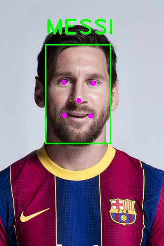
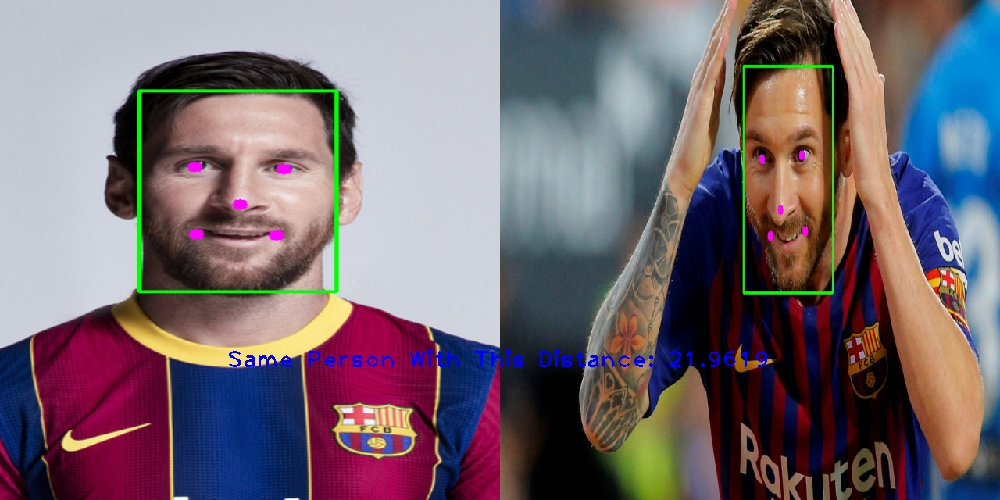

# Face Recognition
## These tasks solved with this repo
- Verification: I used [InsightFace](https://github.com/deepinsight/insightface/tree/master/python-package) package for face verification, allowing you to compare two images and determine if they are the same person.

- Identification: I used [InsightFace](https://github.com/deepinsight/insightface/tree/master/python-package) package for face identification, allowing you to recognize different people.

- Face ID: At the end of the readme you will see I wrote a super snake game that it has a face recognition at the beginning of it.

## How to install
### Run this command:
```bash
pip install -r requirements.txt
```

## How to run identification:
### First create a face bank directory
```
face_bank
│
└───Messi
│   │   Messi_image_1.jpg
│   │   Messi_image_2.jpg
│   │   ...
│   
└───Ronaldo
│   │   Ronaldo_image_1.jpg
│   │   Ronaldo_image_2.jpg
│   │   ...
│
│
...
```
### Then run this command to create a face bank
```bash
python create_face_bank.py --face-bank ./face_bank
```
#### You can also see the other arguments of it with this command
```bash
python create_face_bank.py --help
```
*For Example:*
- *`--model`*: You can chose one of these [models](https://github.com/deepinsight/insightface/tree/master/python-package#model-zoo). **default:***`buffalo_s`*
- *`--face-bank`*: You can change the face bank directory path. **default:***`face_bank`*
- *`--face-bank-name`*: You can change the face bank file name. **default:***`face_bank.npy`*


### After that run this command
```bash
python face_identification.py --img YOUR_IMAGE.JPG
```

### You can also see the other arguments of it with this command
```bash
python face_identification.py --help
```
*For Example:*
- *`--model`*: You can chose one of these [models](https://github.com/deepinsight/insightface/tree/master/python-package#model-zoo). **default:***`buffalo_s`*
- *`--thresh`*: You can change the threshold of distances between tow faces. **default:***`25`*
- *`--face-bank`*: You can change the face bank file path. **default:***`face_bank.npy`*
- *`--update, --no-update`*: You can update the face bank file. **default:***`False`*
- *`--face-bank-path`*: You can change the face bank directory path if you want to update the face bank file. **default:***`face_bank`*

### Result of identification:



## How to run verification:
### First run this command to create a face bank
```bash
python face_verification.py --img1 YOUR_FIRST_IMAGE.jpg --img2 YOUR_SECOND_IMAGE.jpg
```
#### You can also see the other arguments of it with this command
```bash
python face_verification.py --help
```
*For Example:*
- *`--model`*: You can chose one of these [models](https://github.com/deepinsight/insightface/tree/master/python-package#model-zoo). **default:***`buffalo_s`*
- *`--thresh`*: You can change the threshold of distances between tow faces. **default:***`25`*
- *`--show, --no-show`*: You can see the result by this command **default:***`False`*


### Result of identification:



## Face ID in Super Snake:

**First make your face bank with create_face_bank.py then run this command:**
```bash
cd snake \
python main.py
```

***you can change these variables as well:***
```python
access, message = FaceIdentification.make_online(
    model='buffalo_s',
    thresh=25,
    face_bank_path='./face_bank.npy',
    camera_id=0,
    is_show=False  # Keep it false I have a threading error here 🙂️
)
```
